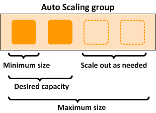

**Auto Scaling là gì ?**

Auto Scaling là phương pháp giúp tự động mở rộng hoặc giảm thiểu số lượng các tài nguyên máy tính được phân phối cho ứng dụng vào bất kỳ thời điểm nào theo nhu cầu sử dụng.

Auto scaling kết hợp chặt chẽ với load balancing. Nói một cách chính xác, bộ load balancer không yêu cầu khả năng tự động scale. Tuy nhiên, các bộ load balancer bao gồm cả auto scaling thì sẽ mang lại hiệu quả hơn nhiều. Ngoài ra, tính năng auto scaling cũng rất lý tưởng với việc chạy cân bằng tải chạy trên các dịch vụ đám mây, do đó hầu hết các nhà cung cấp cloud services lớn đều tích hợp cả 2 tính năng này vào dịch vụ của họ.

**Ưu điểm của việc sử dụng Auto Scaling**
- Đối với các công ty chạy trên nền tảng web server của chính mình, auto-scaling cho phép một số server ngừng hoạt động trong thời gian thấp điểm, giúp tiết kiệm chi phí vận hành như tiền điện, tiền nước.

- Đối với các công ty chạy hạ tầng cơ sở trên đám mây, auto scaling đồng nghĩa với chi phí thấp bởi hầu hết các nhà cung cấp dịch vụ đám mây tính phí dựa trên tổng mức sử dụng chứ không dựa trên công suất tối đa.

- Ngay cả đối với các công ty không thể giảm tổng dung lượng tài nguyên chạy hoặc tài nguyên thanh toán trong một thời điểm bất kỳ, auto scaling sẽ cho phép công ty chạy các công việc ít có độ nhạy cảm về thời gian trên các máy đã được auto scaling trong thời gian lượng traffic thấp.

- Auto scaling có thể mang lại tỷ lệ uptime tốt hơn và tính sẵn sàng cao hơn trong trường hợp khối lượng công việc thay đổi đột ngột và bất ngờ.

**Cách hoạt động**

- Số lượng các instance được tạo ra và đóng gói trong một nhóm được gọi là *Auto-Scaling group* được xem như là một đơn vị logic cho mục đích mở rộng và quản lý.
- Ví dụ: *Auto-Scaling group* như hình ở trên có kích thước tối thiểu là 1 instance, dung lượng mong muốn là 2 instances và kích thước tối đa là 4 instances. Các instance sẽ được tự động điều chỉnh trong khoảng tối thiểu và tối đa dựa trên các tiêu chí đã chỉ định.

**Các hình thức Auto scaling**

Khi cấu hình một hệ thống auto scaling, thường có một cài đặt (thường được gọi là chính sách của nó) để xác định cách tính tỷ lệ xảy ra. Có ba lựa chọn điển hình: scheduled(lên lịch), reactive(phản ứng) và predictive(dự đoán).

***Scheduled scaling*** có nghĩa là các máy chủ được đưa lên và xuống tự động, theo một lịch trình đặt trước. Ví dụ: một công ty có thể có nhiều yêu cầu về khối lượng công việc hơn trong giờ làm việc. Do đó, một số máy chủ nhất định có thể được lên lịch ngoại tuyến mỗi đêm. Điều này làm giảm việc sử dụng điện và các chi phí hoạt động khác.

***Reactive scaling*** có nghĩa là các máy chủ được đưa lên và xuống để phản ứng với những thay đổi về khối lượng công việc. Khi khối lượng công việc tăng lên, hệ thống sẽ phản hồi bằng cách đưa nhiều máy chủ trực tuyến hơn. Sau đó, khi yêu cầu khối lượng công việc giảm, các máy chủ lại được đưa vào ngoại tuyến.

Reactive scaling hiệu quả hơn nhiều so với Scheduled scaling, tuy nhiên, nó cũng phức tạp hơn nhiều.
Hệ thống phải có khả năng đánh giá chặt chẽ và chính xác khối lượng công việc đến, đồng thời đánh giá dung lượng bổ sung có sẵn trong các máy chủ hiện đang trực tuyến. Điều này được gắn chặt với hoạt động của bộ cân bằng tải. Có nhiều số liệu có thể sử dụng để đánh giá dung lượng, ví dụ: mức sử dụng băng thông hiện tại, số lượng kết nối, mức sử dụng CPU, mức sử dụng bộ nhớ, v.v. Mỗi chỉ số đều có ưu điểm và nhược điểm.

Tính năng Reactive scaling có thể rất hiệu quả, nhưng nó có một lỗ hổng tiềm ẩn. Nó đợi cho đến khi khối lượng công việc tăng lên trước khi tăng quy mô tài nguyên tính toán. Điều này có nghĩa là có một sự chậm trễ nhỏ: một khoảng thời gian ngắn mà khối lượng công việc nhiều hơn, nhưng vẫn chưa có nhiều dung lượng hơn. Khi khối lượng công việc tăng nhanh, điều này có thể gây ra sự cố và máy khách có thể gặp phải tình trạng giảm hiệu suất.

***Predictive scaling*** được thiết kế để giải quyết vấn đề này. Hệ thống phân tích dữ liệu lịch sử để xác định các kiểu sử dụng tài nguyên và áp dụng thông tin này cho các điều kiện hiện tại. Mục tiêu của nó là dự đoán khi nào khối lượng công việc sẽ tăng lên và để mở rộng dung lượng máy chủ ngay lập tức trước khi chúng thực hiện.

Trong ba loại tỷ lệ thì predictive scaling là phức tạp nhất và thách thức nhất để thực hiện chính xác.

**Tương lai của Auto Scaling**

Autoscaler ngày nay rất mạnh mẽ và phức tạp, nhưng các nhà cung cấp vẫn đang tiếp tục nỗ lực để cải thiện chúng.

Ví dụ: ba loại scaling được mô tả ở trên không loại trừ lẫn nhau và một trình tự động chia tỷ lệ mạnh mẽ sẽ cung cấp khả năng sử dụng nhiều chính sách. Ví dụ: AWS EC2 có thể được định cấu hình để sử dụng đồng thời chia tỷ lệ “động” (tức là phản ứng) và mở rộng dự đoán. Các nhà nghiên cứu đang làm việc để định lượng và chính thức hóa các phương pháp hay nhất để kết hợp các chính sách này, để các tổ chức có thể đạt được kết quả tối ưu cho các ứng dụng cụ thể

Nguồn: [Reblaze wiki](https://www.reblaze.com/wiki/load-balancing/what-is-auto-scaling/)

`Happy coding !!!`
